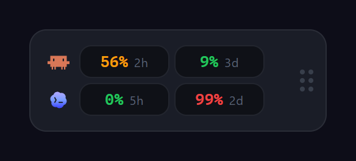

# BurnRate

Always-on-top desktop widget that shows how much of your **Claude** and **Codex**
usage limits you've burned through — at a glance.


<p align="center">
  
</p>

## What it does

BurnRate floats over your other windows as a compact pill showing the percentage
of your Claude and Codex rate-limit windows you've already used. Click it to expand
a detail panel with progress bars and reset countdowns. That's the whole product —
no dashboards, no token totals, no account login.

It reads the credentials the **Claude Code** and **Codex** CLIs already store on
your machine, so there is nothing to paste and no session key to manage.

## Features

- Compact, always-on-top pill with live usage percentages for Claude and Codex
- Expandable detail panel with progress bars and reset countdowns
- **Claude:** 5-hour window, 7-day window, and overage (extra credits)
- **Codex:** primary and secondary rate-limit windows
- Auto-refresh every 60 seconds (cached, so it barely touches your quota)
- System tray with show / refresh / quit
- Autostart with your OS
- Drag the pill anywhere — your position is remembered across restarts
- Built-in auto-updater
- One bridge button to open [TokenBBQ](https://github.com/offbyone1/tokenbbq) for full token totals
- Credentials are read in the Rust backend and never exposed to the webview; no telemetry

## How it works

BurnRate never asks you for a password. It reuses the tokens the official CLIs
already wrote to disk:

**Claude** — reads the OAuth access token from `~/.claude/.credentials.json`
(honors `CLAUDE_CONFIG_DIR`), makes a minimal `max_tokens=0` call to
`api.anthropic.com`, and parses the `anthropic-ratelimit-unified-*` response
headers for the 5-hour / 7-day / overage windows. Each refresh costs roughly a
handful of input tokens, throttled to once per 60 seconds.

**Codex** — reads the access token from `~/.codex/auth.json` (honors `CODEX_HOME`)
and queries `chatgpt.com/backend-api/wham/usage` for the primary and secondary
windows. If Codex isn't set up, its tiles simply stay empty — no error.

Both calls go straight to the official APIs. Nothing is sent to any third party,
and tokens never leave the Rust backend.

## Requirements

- **Windows 10/11** with WebView2 (pre-installed on modern Windows)
- For the **Claude** tile: the [Claude Code](https://claude.com/claude-code) CLI
  installed and logged in (so `~/.claude/.credentials.json` exists)
- For the **Codex** tile: the Codex CLI installed and logged in
  (so `~/.codex/auth.json` exists)

You only need one of the two to get a useful widget — whichever you have set up
will show; the other tile stays empty.

## Install

Download the installer from the [latest release](https://github.com/offbyone1/BurnRate/releases/latest)
and run it. BurnRate updates itself from then on.

## Setup

There is no setup. If you already use the Claude Code and/or Codex CLIs and are
logged in, launch BurnRate and it picks up your usage immediately. If a tile is
empty, log in to the matching CLI:

```bash
claude    # then sign in — creates ~/.claude/.credentials.json
codex     # then sign in — creates ~/.codex/auth.json
```

## Build from source

### Prerequisites

- [Rust](https://rustup.rs/) (stable)
- [Node.js](https://nodejs.org/) 20+
- Windows: Microsoft C++ Build Tools

### Steps

```bash
git clone https://github.com/offbyone1/BurnRate.git
cd BurnRate
npm install
npx tauri build      # installers land in src-tauri/target/release/bundle/
```

For development with hot reload:

```bash
npm install
npx tauri dev
```

## Releases & auto-update

Releases are produced by the GitHub Actions workflow in
[`.github/workflows/release.yml`](.github/workflows/release.yml). Pushing a
version tag (e.g. `v0.6.1`) builds the signed installers and the `latest.json`
manifest, then attaches them to a GitHub release. The app's updater endpoint
(`src-tauri/tauri.conf.json`) points at this repo's `releases/latest`, so shipped
builds upgrade themselves once a newer release exists.

The workflow needs two repository secrets:

| Secret | What it is |
| --- | --- |
| `TAURI_SIGNING_PRIVATE_KEY` | The minisign private key matching the `pubkey` in `tauri.conf.json` |
| `TAURI_SIGNING_PRIVATE_KEY_PASSWORD` | The password for that key |

Generate a key pair once with `npx tauri signer generate` and keep the private
key out of the repo.

## Tests

The Rust unit tests cover the Codex rate-limit parsing:

```bash
cd src-tauri
cargo test
```

Frontend logic tests live in `tests/` and use the Node test runner:

```bash
npm test
```

## License

[MIT](LICENSE)
